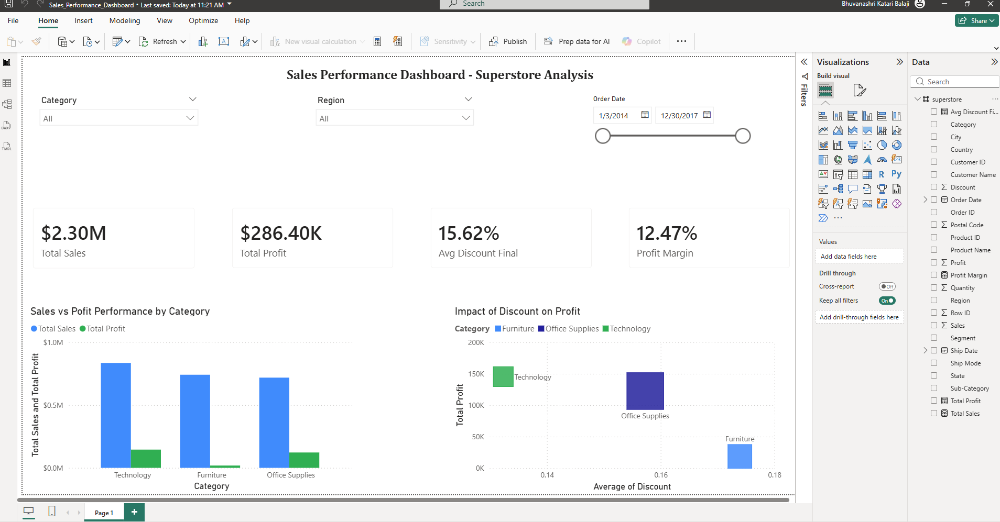

# 📊 Retail Profitability Analysis — Detecting Revenue Leakage & Optimizing Pricing

## 📊 Dashboard Preview
📌 This dashboard enables decision-makers to identify profit leakage and optimize pricing strategies in real time.

> 📌 Built using Power BI with interactive filters and drill-down capabilities

---

## 📌 Executive Summary

This project analyzes retail sales data to uncover revenue leakage and identify key drivers of profitability.

The analysis reveals that high-revenue categories often generate low or negative profit due to excessive discounting and inefficient pricing strategies.

By shifting focus from sales volume to profit optimization, this project provides actionable insights to improve margins and drive sustainable business growth.

---

## 📈 Why This Project Matters

Many businesses focus on increasing sales without understanding profitability drivers.
This project highlights how discounting strategies can silently reduce margins despite strong revenue growth.

---

## 💼 Business Problem

Retail businesses often prioritize sales volume without fully understanding profit drivers. High discounting and inconsistent pricing strategies can lead to strong revenue growth but poor margins.

This project aims to:

* Identify which categories and products drive profit vs loss
* Analyze the impact of discounting on profitability
* Detect inefficiencies in pricing and sales strategy

---

## ❓ Key Business Questions

* Which product categories generate high sales but low profit?
* How do discounts impact profitability?
* Which regions contribute most to profit and revenue?
* Are there products driving revenue but causing losses?

---

## 🚀 Project Overview

This is an end-to-end retail sales analysis project using Python (Pandas) and Power BI.

The analysis focuses on understanding category-level performance, discount impact, and profit distribution across products and regions.

The goal is to move beyond sales tracking and enable profitability-driven decision-making.

---

## 📊 Visualization Summary

The Power BI dashboard provides a comprehensive view of sales performance, profitability, and discount impact across categories, products, and regions.

Key visuals include:

* Sales vs Profit by Category
* Discount vs Profit relationship
* Regional performance comparison
* Product-level profitability analysis

---

## 🎯 Key Insights

- The Furniture category generates high revenue but consistently low or negative profit, indicating severe margin inefficiency  
- High discount levels are directly impacting profitability, revealing a trade-off between sales volume and margin sustainability  
- The Technology category maintains strong profitability with lower dependency on discounts, making it the most efficient revenue driver  
- Several high-sales products contribute minimal or negative profit, highlighting hidden profit leakage at the product level  
- Regional performance varies significantly, suggesting operational inefficiencies and uneven market strategies  

---

## 💡 Business Impact

* Enables optimization of discount strategies to protect margins
* Identifies loss-making products and categories
* Supports data-driven pricing and promotion decisions
* Improves overall revenue quality, not just revenue quantity

---

## 💡 Recommendations

- Reduce excessive discounting, especially in low-margin categories like Furniture  
- Reevaluate pricing and supply chain costs for underperforming product categories  
- Focus marketing and inventory efforts on high-profit categories like Technology  
- Identify and phase out or reprice loss-making products  
- Optimize regional strategies by investing more in high-performing markets and fixing underperforming ones  

---

## 🛠️ Tools Used

* Python (Pandas)
* Power BI
* DAX

---

## ⚙️ Technical Highlights

* Performed data cleaning and preprocessing (missing values, type conversions)
* Engineered features such as profit margin and time-based attributes
* Conducted exploratory data analysis to identify trends and anomalies
* Built calculated measures in Power BI using DAX
* Designed an interactive Power BI dashboard with dynamic filters and drill-down capabilities

---

## 🔄 Project Workflow

1. Data Loading
   Loaded dataset using Pandas

2. Data Understanding
   Explored structure, missing values, and duplicates

3. Data Cleaning
   Converted date formats and handled inconsistencies

4. Feature Engineering
   Created Month, Year, and Profit Margin

5. Exploratory Data Analysis
   Analyzed trends across categories, regions, and segments

6. Profitability Analysis
   Identified high-sales but low-profit products

7. Discount Impact Analysis
   Evaluated how discount levels affect profitability

8. Visualization
   Built Power BI dashboard with KPIs and filters

---

## 📂 Files Included

* `python/sales_analysis.py`
* `data/superstore.csv`
* `Sales_Performance_Dashboard.pbix`
* `images/dashboard_preview.png`

---

## 📌 Conclusion

Business profitability is not driven by sales alone. Discount strategy plays a major role, especially in underperforming categories like Furniture.

---

## 📚 Key Learnings

* Sales growth does not always translate to profitability
* Discount strategies must be optimized to protect margins
* Data visualization plays a crucial role in uncovering insights
* End-to-end analytics involves data cleaning, analysis, and storytelling
  
The project demonstrates how data-driven insights can directly influence pricing, discount strategies, and overall business profitability.
